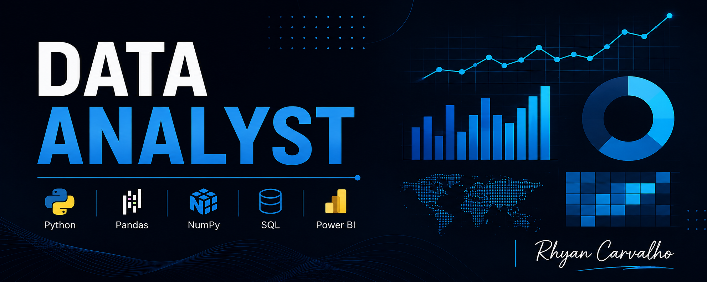

# Rhyan Carvalho

*Analista de Dados*

Minha experiência na área de dados ainda é bem recente, comecei minha dedicação maior ao conteúdo a partir do primeiro semestre de 2025, devido a sempre precisar conciliar com uma faculdade de Direito e o trabalho.

Desde então venho me capacitando através de cursos, lives e projetos práticos, principalmente pelo YouTube, aprofundando meu conhecimento técnico e minha visão analítica. Por vir de uma formação totalmente de humanas, sei que meus desafios são maiores mas isso não me afasta do meu objetivo de conquistar uma vaga em Analytics.

**Background em:** SQL, Python, Power BI, Excel avançado (Power Query), (LGPD)

**Links:**
- [LinkedIn](https://www.linkedin.com/in/rhycarvalho/)

---

## 📊 Projetos

Aqui alguns projetos que venho desenvolvendo, tanto através de cursos quanto por iniciativa própria:

- **Análise Exploratória - E-commerce Brasileiro (Olist):** [Apresentação-Brazilian E-Commerce Public Dataset](./Apresenta%C3%A7%C3%A3o-Brazilian%20E-Commerce%20Public%20Dataset.ipynb)
- **Delivery Analytics com SQL:** [Delivery_Analytics_SQL.ipynb](./Delivery_Analytics_SQL.ipynb)
- **Roubo e Furto de Veículos no RJ (2023-2025):** [Roubo_Furto_Veiculos_RJ_2023_2025.ipynb](./Roubo_Furto_Veiculos_RJ_2023_2025.ipynb)
- **Analise de Vendas:** [analise_vendas_cafeteria.ipynb](./analise_vendas_cafeteria.ipynb)

---

## 📈 Dashboards Power BI

- *
